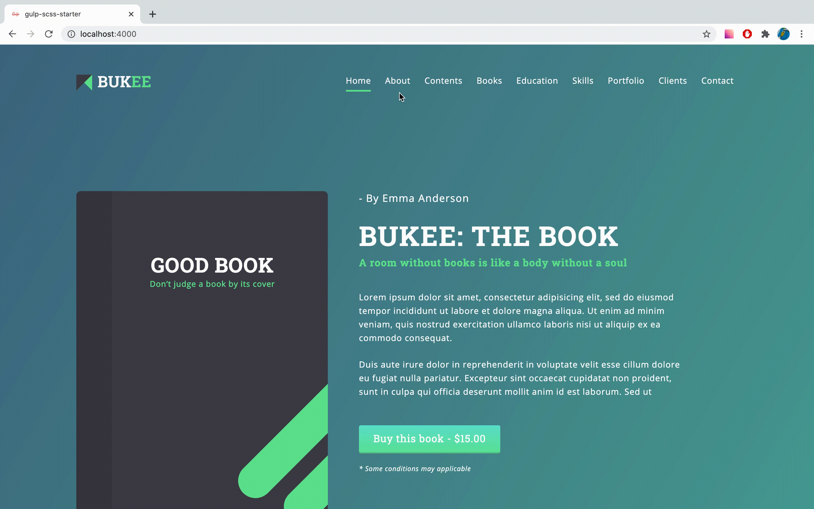
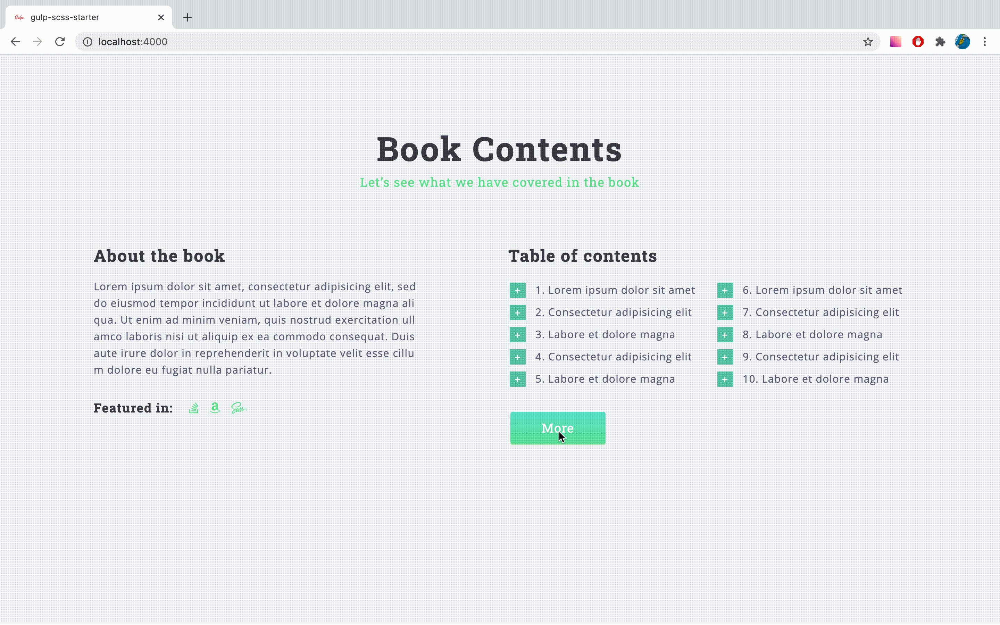

# Bukee
*//Russian version*

Результат моей работы на курсе по продвинутой веб-разработке. Где была использована:
* Методология БЭМ
* Препроцессоры sass/scss
* Сборщик проектов Gulp 
* JavaScript
* Библиотеки jQuery и slickslider(для добавления динамики в проект)

Поближе с проектом вы можете познакомиться по [ссылке](https://marat-medvedev.github.io/Bukee/)

## Инструкция по сборке и запуску проекта:
1. В нужной нам директории открываем терминал и вводим `git clone https://github.com/Marat-Medvedev/Bukee`. В результате выполнения пункта 1 мы создаем клон удалённого репозитория в нужной нам папке.
2. Для запуска проекта вам понадобиться глобально установить на свое устройство сборщик проектов gulp, сделать это можно используя пакетные менеджеры npm или yarn. Я покажу на примере Yarn.
3. Для начала установите [NodeJS](https://nodejs.org/en/) (если требуется) и [Yarn](https://classic.yarnpkg.com/en/docs/install).
4. После установки NodeJS и Yarn, открыв терминал глобально, установите gulp: `yarn global add gulp-cli`.
5. Открываем терминал в нужной нам директории(папка со скаченным проектом) и вводим: `yarn run dev`.

Если вы всё сделали правильно, у вас должен открыться браузер с локальным сервером. 

*//English version*

Training project for the "tpverstak" course using:
* BEM 
* Preprocessor sass/scss
* Gulp
* JavaScript
* JS libraries jQuery and Slickslider

You can learn more about the project by following the [link](https://marat-medvedev.github.io/Bukee/)

## Instructions for building and launching the project:
1. In the desired directory, open the terminal and enter `git clone https://github.com/Marat-Medvedev/Bukee`. As a result of step 1, we create a clone of the remote repository in the folder we need.
2. To start a project, you need to install the Gulp globally on your device. You can do this using the NPM or Yarn package managers. I'll show you the Yarn example.
3. To get started, install [NodeJS](https://nodejs.org/en/) (if required) and [Yarn](https://classic.yarnpkg.com/en/docs/install).
4. After installation NodeJS and Yarn, open the terminal globally and install Gulp: `yarn global add gulp-cli`.
5. Open the terminal in the desired directory(the folder with the downloaded project) and enter: `yarn run dev`.

If you did everything correctly, the browser opens with the local server.

# Скриншоты/Screenshots 

